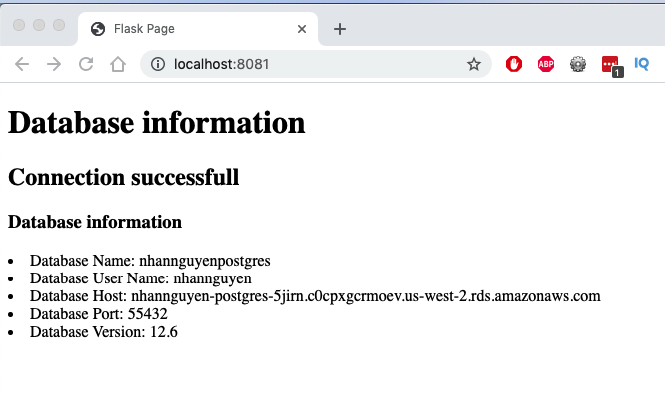

# DevOps IT Test

## Requirements

 - Create a Container Registry to hold container image
 - Create an S3 bucket, which is public to the internet, and capable of static web hosting
 - Create a HelloWorld style static HTML website and store it in GIT
 - Create a PostgreSQL RDS instance
 - Connection credentials should be stored in SSM ParameterStore
 - Create a Python application which connects to the RDS instance and print out
   - Connection properties
   - RDS version
   - Credentials should be retrieved from SSM ParameterStore
   - Create a Dockerfile into GIT which contains the Python application and set as a starting point
 - Create a CI pipeline with the following tasks
   - Create an EC2, and install Jenkins on it or use AWS CodePipeline
   - Create a source step which clones the given GIT repository
   - Create a build step which build a Docker container and upload it to the Registry
   - Create a deploy step which uploads a static html to the S3 bucket

## Preparation 
- Create AWS user with administrator permission
- update the aws configure file with profile name `infinite-lamda-devops`
- Create repository in Codecommit with name 
	- `static_html` for index.html file
	- `flask_postgress` for python application 

## Solution
Checkout this repository to local machine and run
   

     make backend
for initial backend for terraform project

 1. Create an S3 bucket, which is public to the internet, and capable of static web hosting. 
 
 Run the command:
   

     make s3

The result will be:
   

     s3_static_bucket_name = "nhan-nguyen-08282021-c2jrh"
     s3_static_website_endpoint = "nhan-nguyen-08282021-c2jrh.s3-website-us-west-2.amazonaws.com"

2. Create a PostgreSQL RDS instance and Connection credentials should be stored in SSM ParameterStore

Run command
   

     make database

The result will be:

     db_address = "nhannguyen-postgres.c0cpxgcrmoev.us-west-2.rds.amazonaws.com"
     db_endpoint = "nhannguyen-postgres.c0cpxgcrmoev.us-west-2.rds.amazonaws.com:55432"
     ssm_db_credentials = "/rds/postgress/credentials"

3. Create a Python application which connects to the RDS instance and print out

Update the `env_file` file, change the the AWS_ACCESS_KEY, AWS_ACCESS_SECRET_KEY, AWS_DEFAULT_REGION, SSM_PARAMETER with the value on last step. Afer that, use the command

     make docker

Open browser and access to address: `localhost:80801`. The result will be

4. Create a CI pipeline deploy static html to s3,  build docker container and upload to registry
- Upload all the file on `static_html` folder to repository name `static_html` have been created on preparation step
- Upload all the file on `flask_postgress folder` to repository name `flask_postgress` have been created on preparation step

For deploy the static html, run command

     make deploy_static

The result will be:

     s3_static_bucket_endpoint = "nhan-nguyen-08282021-c2jrh.s3-website-us-west-2.amazonaws.com"

Open browser and access to address: `nhan-nguyen-08282021-c2jrh.s3-website-us-west-2.amazonaws.com`. The result will be

For build docker image and upload this to ECR, run command

     make deploy_docker

